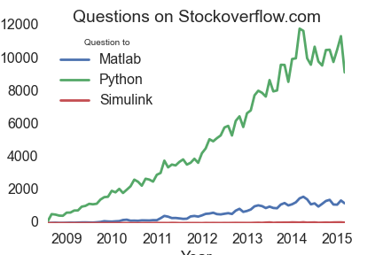
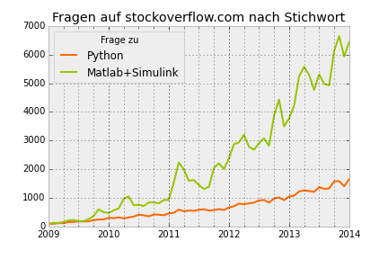

Matlab-vs-Python
================

Questions on stockoverflow.com

Based on the [R and python usages](https://github.com/hadley/r-python) by @hadley, I tried it for `Python` vs. `Matlab+Simulink`.

It looks pretty clear for Python

But if you look at the relative ones, `Matlab` is increasing pretty much in the same rate.

